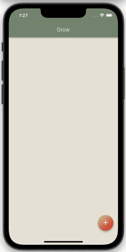
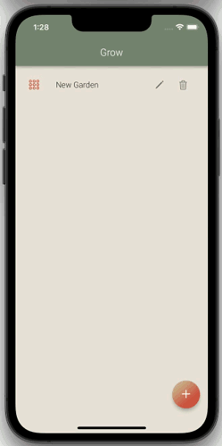
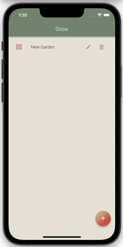
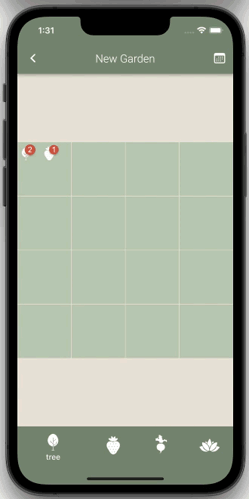
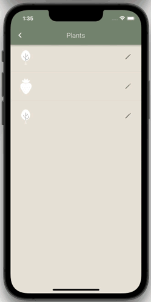
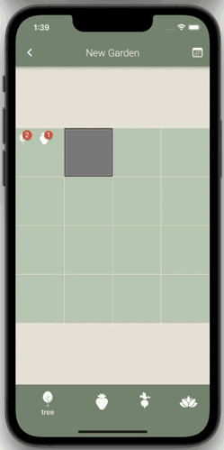

# Grow
Multi-platform application for keeping track of your garden and plants.

## Table of contents
* [General info](#general-info)
* [Usage](#usage)
* [Components](#components)
* [Technologies](#technologies)
* [Setup](#setup)
* [Features](#features)
* [Status](#status)
* [Licence](#licence)
* [Contact](#contact)

## General info

Multi-platform application for keeping track of your garden and plants.

Runs on Windows, Android, macOS and iOS.

Capturing images is supported only on Android and iOS. 

Implemented using Provider pattern.

## Usage
### Create garden

### Edit garden

### Drag and drop of plants on garden tiles

### Edit garden tile type - long press

## Overview of plants on tile - short press

## Edit plant

## Overview of plant related activities in the calendar

## Technologies
* Flutter 2.8.1
* Dart 2.15.1
* [Provider](https://pub.dev/packages/provider)
* [Hive](https://pub.dev/packages/hive)

## Setup
To run this project make sure you have installed:
* [Flutter](https://docs.flutter.dev/get-started/install)
* [Android Studio](https://docs.flutter.dev/get-started/editor?tab=androidstudio) or [VS Code](https://docs.flutter.dev/get-started/editor?tab=vscode)

## Features

* Create garden
* Edit garden
* Drag and drop of plants on garden tiles
* Edit garden tile type
* Overview of plants on tile
* Edit plant
* Capturing image of a plant or taking photo from gallery
* Overview of plant related activities in the calendar (watering, fertilizing, apply pesticide)

To-do list:
* Bugfixes
* Tests

## Status
Project is in progress.

## Licence

This project is licensed under the GNU GPL v3 License - see the [LICENSE.md](https://github.com/NikolaGrujic91/garden_planner_app/blob/main/LICENSE) file for details.

## Contact
Created by Nikola Grujic - feel free to contact me!

grujic.nikola91@gmail.com

[Nikola Grujic | LinkedIn](https://www.linkedin.com/in/nikola-grujic-735a7284/)

